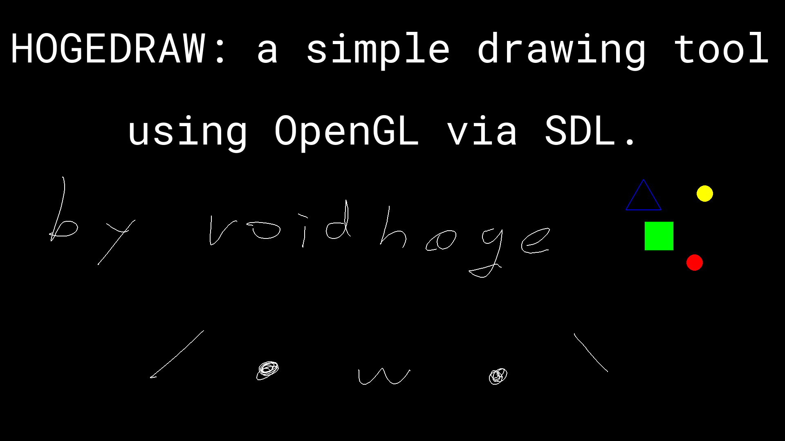

# HOGEDRAW
- hogedraw: a simple drawing tool using SDL_opengl.


- This project file is availabe at [here](./welcome.txt).

## REQUIREMENTS
- A compiler that supports C++11 or higher.
- libsdl2-dev
- libglut-dev
- libgl-dev
- libsdl2-image-dev
- libftgl-dev

## BUILD
```
$ make
c++ main.cpp -c -std=c++11 -O3 -mtune=native -march=native -I/usr/include/SDL2 -D_REENTRANT  -lSDL2  -lSDL2_image -lGL  -DFREEGLUT_STATIC  -lglut  -I/usr/include/FTGL -I/usr/include/freetype2 -I/usr/include/libpng16  -lftgl  -lSDL2_image -lSDL2  -o main.o
c++ hogedraw.cpp -c -std=c++11 -O3 -mtune=native -march=native -I/usr/include/SDL2 -D_REENTRANT  -lSDL2  -lSDL2_image -lGL  -DFREEGLUT_STATIC  -lglut  -I/usr/include/FTGL -I/usr/include/freetype2 -I/usr/include/libpng16  -lftgl  -lSDL2_image -lSDL2  -o hogedraw.o
c++ object.cpp -c -std=c++11 -O3 -mtune=native -march=native -I/usr/include/SDL2 -D_REENTRANT  -lSDL2  -lSDL2_image -lGL  -DFREEGLUT_STATIC  -lglut  -I/usr/include/FTGL -I/usr/include/freetype2 -I/usr/include/libpng16  -lftgl  -lSDL2_image -lSDL2  -o object.o
c++ canvas.cpp -c -std=c++11 -O3 -mtune=native -march=native -I/usr/include/SDL2 -D_REENTRANT  -lSDL2  -lSDL2_image -lGL  -DFREEGLUT_STATIC  -lglut  -I/usr/include/FTGL -I/usr/include/freetype2 -I/usr/include/libpng16  -lftgl  -lSDL2_image -lSDL2  -o canvas.o
c++ lex.cpp -c -std=c++11 -O3 -mtune=native -march=native -o lex.o
c++ option.cpp -c -std=c++11 -O3 -mtune=native -march=native -o option.o
c++ vec.cpp -c -std=c++11 -O3 -mtune=native -march=native -o vec.o
c++ main.o hogedraw.o object.o canvas.o lex.o option.o vec.o -std=c++11 -O3 -mtune=native -march=native -I/usr/include/SDL2 -D_REENTRANT  -lSDL2  -lSDL2_image -lGL  -DFREEGLUT_STATIC  -lglut  -I/usr/include/FTGL -I/usr/include/freetype2 -I/usr/include/libpng16  -lftgl  -lSDL2_image -lSDL2  -o hogedraw
$
```

## USAGE
- Draw line by dragging the mouse pointer.
- Draw string where the mouse pointer is by type the keyboard.

| key                | action                    |
|--------------------|---------------------------|
| Ctrl + q           | Quit                      |
| Ctrl + r           | Draw triangle             |
| Ctrl + f           | Draw square               |
| Ctrl + v           | Draw circle               |
| F1                 | Set to use color 1        |
| F2                 | Set to use color 2        |
| F3                 | Set to use color 3        |
| F4                 | Set to use color 4        |
| F5                 | Set to use color 5        |
| Ctrl + t           | Push canvas to the end    |
| Ctrl + tab         | Switch to next canvas     |
| Ctrl + Shift + tab | Switch to previous canvas |
| Ctrl + s           | Save project as text file |
| Ctrl + p           | Save canvas as png file   |

## .hogedrawrc
- Configure hogedraw by placing setting file in the HOME directory.

```
$ la $HOME | grep .hogedrawrc
-rw-r--r--  1 hoge hoge  377 Jan  2 00:15 .hogedrawrc
$ cat $HOME/.hogedrawrc
color0: (0,0,0)
color1: (255,255,255)
color2: (0,0,255)
color3: (0,255,0)
color4: (255,0,0)
color5: (255,255,0)
linethickness: 2
circlefill: false
circlesize: 50
circlethickness: 2
trianglefill: false
trianglesize: 75
trianglethickness: 2
squarefill: false
squaresize: 100
squarethickness: 2
fontpath: "/home/hoge/.local/share/fonts/Roboto Mono for Powerline.ttf"
fontsize: 50
$
```
- `color0`: background color template
- `color(1|2|3|4|5)`: color templates
- `linethickness`: thickness of line
- `(triangle|square|circle)thickness`: thickness of the shapes outline
- `(triangle|square|circle)fill`: whether to fill the shapes
- `(triangle|square|circle)size`: size(distance between the pointer and vertices) of the shapes
- `fontpath`: the path to a truetype font
- `fontsize`: size of text

## OPTION
- `hogedraw <project file>`: load project from `<project file>`.

## Author
- Mugi Noda(void-hoge)

## LICENSE
- GPLv3
